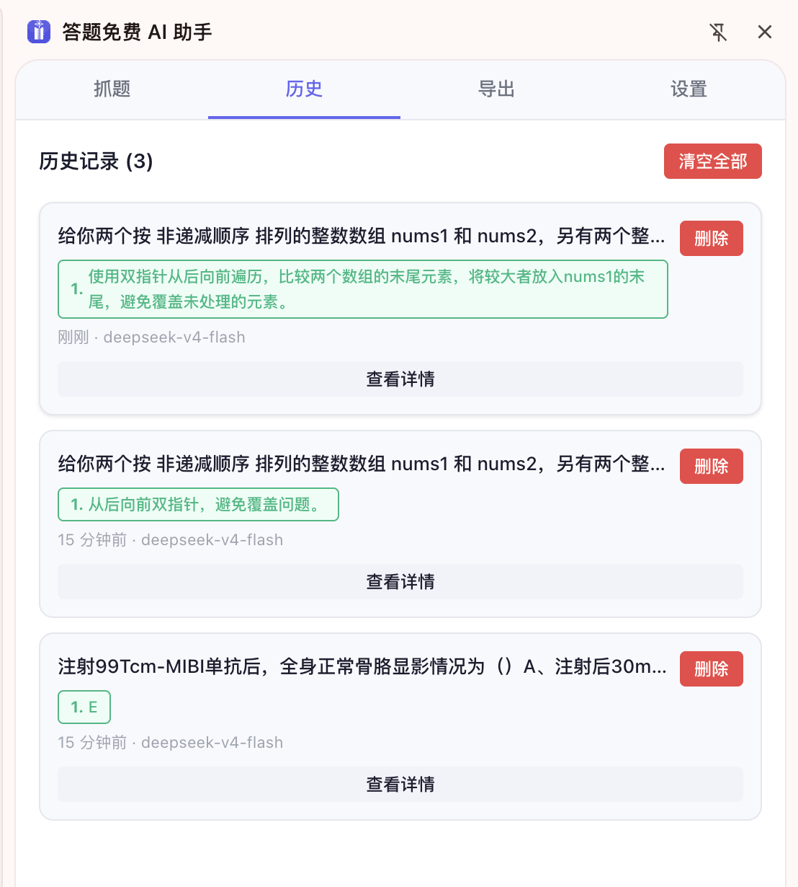
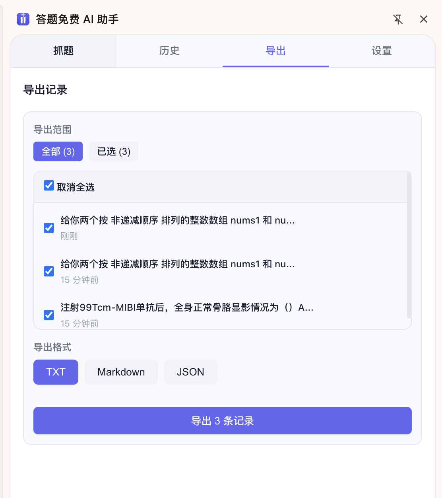

# Answer Free AI Assistant (答题免费 AI 助手)

> A Chrome/Edge browser extension for AI-assisted learning — capture questions from any webpage, parse them with AI, review answers, and export for study.

[简体中文](README.zh-CN.md) · [English](README.md)


## Screenshots

### Capture Page


### History Records


### Export Records


### Settings


## Installation Guide

### Step 1: Download the Extension
Visit the [releases page](https://github.com/jijiutong/answer-free-ai-assistant/releases) and download the latest `dist.zip`, or clone this repository:

```bash
git clone https://github.com/jijiutong/answer-free-ai-assistant.git
cd answer-free-ai-assistant
npm install
npm run build
```

### Step 2: Open Chrome Extensions Page
1. Open Chrome (or Edge) browser
2. Type `chrome://extensions/` in the address bar and press Enter
   - Edge users: type `edge://extensions/`

### Step 3: Enable Developer Mode
1. In the top-right corner of the extensions page, find the **Developer mode** toggle
2. Click to turn it **ON**

### Step 4: Load the Extension
1. Click the **Load unpacked** button that appeared
2. Navigate to and select the `dist/` folder from this project
3. The extension icon (purple book with sparkle) will appear in your toolbar

### Step 5: Pin the Extension
1. Click the puzzle piece icon (🧩) in your Chrome toolbar
2. Find **答题免费 AI 助手** and click the pin icon (📌)
3. The extension is now always accessible from your toolbar!

### Step 6: Configure Your AI Model
1. Click the extension icon → **Settings** tab
2. Click **+ Add** to add your AI model
3. Enter your API credentials (see [Configuration](#configuration) below)

## Features

### Core Workflow
- **Webpage Capture** — One-click extraction of question content from any webpage, with smart DOM filtering to remove navigation, buttons, and noise
- **Remove Restrictions** — Bypass `user-select: none`, copy-disabled, and right-click-blocked pages
- **AI Parsing** — Send captured content to any OpenAI-compatible API (DeepSeek, OpenAI, LM Studio, etc.) for structured answer parsing
- **Result Viewer** — Beautifully rendered structured results: question type, content, options, answer, code (multi-language), and detailed explanation

### Question Types Supported
| Type | Description |
|---|---|
| Single Choice | Auto-extracts correct option with reasoning |
| Multiple Choice | Lists all correct options with analysis |
| True/False | Judgment with explanation |
| Fill-in-the-Blank | Correct answer with solving process |
| Short Answer | Concise answer with detailed explanation |
| Programming | Full runnable code in configured languages + complexity analysis |
| Subjective | Free-response question handling |

### Model Management
- **Multi-model Support** — Configure unlimited AI models (DeepSeek, OpenAI, local models)
- **Per-model Token Limit** — Customizable `maxTokens` per model (default 100,000)
- **JSON Import** — Bulk import model configs from JSON
- **Default Model** — Set a default model for quick switching
- **Active Model Memory** — Remembers last used model

### Explanation System
- **Toggle On/Off** — Enable or disable detailed explanations globally
- **5 Teaching Styles** — Rigorous, Conversational, Guided, Concise, Detailed
- **6 Content Sections** — Question Analysis, Key Point, Steps, Common Mistakes, Summary, Similar Problems
- **Dynamic Prompt Injection** — Teaching config is dynamically injected into the system prompt

### Code Languages
- **12 Languages** — Java, Python, C++, JavaScript, Go, Rust, TypeScript, Kotlin, Ruby, Swift, C#, C
- **Default: Java, Python, C++** — Customizable in settings
- **Per-question Code Tabs** — Switch between languages in result viewer

### Customization
- **Prompt Template** — Editable system prompt with restore-to-default
- **Dark/Light Theme** — Full theme support with smooth transitions
- **Feature Toggles** — Restriction removal can be enabled/disabled

### History & Export
- **Persistent History** — All parsing sessions saved in `chrome.storage.local`
- **Expand/Collapse** — Detailed view with question-by-question breakdown
- **Export Formats** — TXT, Markdown, JSON
- **Export Scope** — All records, selected records, or current session
- **Timestamped Filenames** — Auto-generated filenames with date/time

## Tech Stack

- **Vue 3** — Reactive UI framework
- **Vite** — Fast multi-entry build system
- **Manifest V3** — Latest Chrome extension architecture
- **`chrome.storage.local`** — All data persisted locally
- **OpenAI-compatible API** — Works with DeepSeek, OpenAI, LM Studio, etc.

## Project Structure

```
answer-free-ai-assistant/
├── manifest.json              # Extension manifest (MV3)
├── package.json               # Dependencies & scripts
├── vite.config.mjs            # Vite multi-entry config
── screenshots/               # UI screenshots for README
├── public/
│   └── icons/                 # Extension icons (16/48/128)
├── src/
│   ├── background.js          # Service Worker (side panel, messaging)
│   ├── content/
│   │   └── content.js         # Content script (capture, restriction removal)
│   ├── popup/                 # Browser action popup
│   ├── sidepanel/             # Side panel views
│   │   ├── views/             # Capture, History, Export, Settings
│   │   └── components/        # Reusable components
│   ├── shared/                # Shared modules (api, storage, utils)
│   └── styles/                # Global CSS design tokens
└── dist/                      # Build output (load this into Chrome)
```

## Development

### Prerequisites
- Node.js 18+
- npm or pnpm

### Install Dependencies
```bash
npm install
```

### Development Mode
```bash
npm run dev        # Watch mode, auto-rebuild on changes
```

### Production Build
```bash
npm run build      # Production build → dist/
```

### Update After Changes
1. Run `npm run build` to rebuild
2. Go to `chrome://extensions/` and click the **refresh** icon on the extension card

## Configuration

### Adding an AI Model
1. Open extension → Settings → Model Config
2. Click **+ Add** or **JSON Import**
3. Fill in: Name, API URL, API Key, Model Name, Max Tokens
4. Set as default if needed

**Example API configs:**
| Provider | API URL |
|---|---|
| DeepSeek | `https://api.deepseek.com/v1` |
| OpenAI | `https://api.openai.com/v1` |
| LM Studio | `http://localhost:1234/v1` |

## Data Privacy

All data (model configs, history, settings) is stored locally in `chrome.storage.local`. Nothing is sent to any server except the API requests you configure.

## License

MIT

---

Built with [Vue 3](https://vuejs.org/) + [Vite](https://vitejs.dev/)
